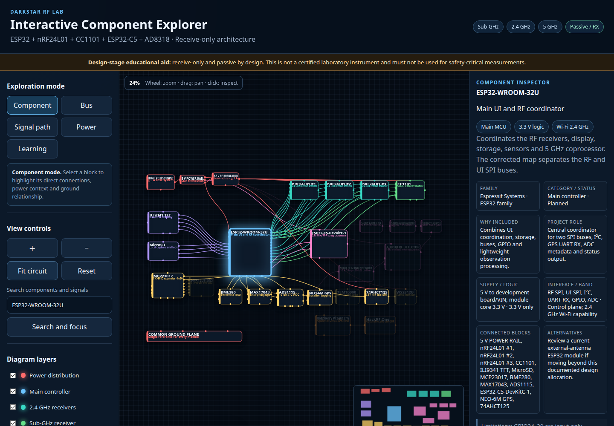
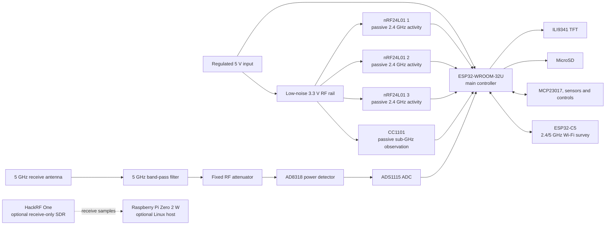
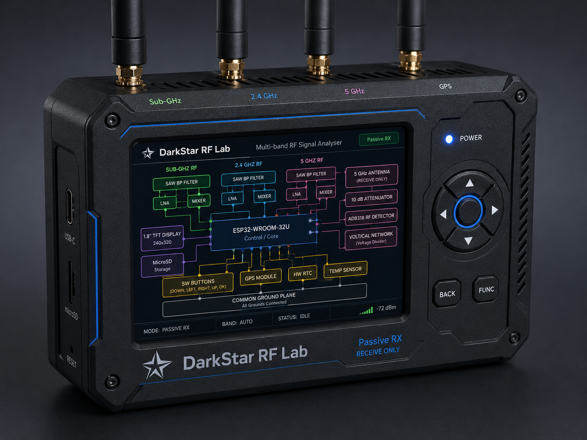

<div align="center">

# DarkStar RF Lab

**A modular passive RF observation and spectrum visualisation platform for
sub-GHz, 2.4 GHz, and 5 GHz experimentation.**


</div>



> [!IMPORTANT]
> DarkStar RF Lab is at the **concept and hardware-design stage**. The
> repository contains an implemented offline circuit guide and a corrected
> wiring reference, but it does not yet contain firmware, PCB files, enclosure
> CAD, prototype measurements, or evidence of a completed physical instrument.

## Contents

- [Overview](#overview)
- [Project status](#project-status)
- [Capabilities and scope](#capabilities-and-scope)
- [System architecture](#system-architecture)
- [Frequency coverage](#frequency-coverage)
- [Planned hardware](#planned-hardware)
- [Confirmed design pin map](#confirmed-design-pin-map)
- [Power design](#power-design)
- [Interactive circuit guide](#interactive-circuit-guide)
- [Getting started](#getting-started)
- [Assembly overview](#assembly-overview)
- [Calibration and receive-only testing](#calibration-and-receive-only-testing)
- [Repository structure](#repository-structure)
- [Screenshots and media](#screenshots-and-media)
- [Roadmap](#roadmap)
- [Known limitations](#known-limitations)
- [Responsible use](#responsible-use)
- [Contributing](#contributing)
- [Documentation](#documentation)
- [Author](#author)
- [Licence](#licence)

## Overview

DarkStar RF Lab is a proposed portable, modular platform for passive RF
observation, Wi-Fi surveying, filtered power measurement, and on-device
visualisation. It is intended for students, radio and electronics enthusiasts,
embedded developers, and authorised laboratory users who want one documented
architecture spanning common sub-GHz bands, 2.4 GHz activity, and selected
5 GHz observations.

The design combines specialised receive paths instead of presenting every
measurement as a conventional spectrum analyser. Each path has a deliberately
limited role:

- CC1101 hardware is planned for passive sub-GHz observation.
- Three nRF24L01 modules are planned for coarse 2.4 GHz channel-activity
  scanning.
- An ESP32-C5-DevKitC-1 is planned as a dual-band Wi-Fi survey coprocessor.
- A filtered AD8318 path is planned to measure aggregate RF power in a selected
  5 GHz passband.
- An optional HackRF One and Linux host may add a receive-only,
  frequency-selective waterfall.

The intended use is passive RF observation, authorised laboratory testing,
education, electronics development, and spectrum visualisation. Active
interference, signal jamming, spoofing, and packet injection are outside the
project scope.

## Project status

| Area | Verified status | Evidence |
|---|---|---|
| Project architecture | Concept documented | This README and the circuit guide |
| Hardware design | Wiring reference available | [`docs/hardware/wiring-reference.md`](docs/hardware/wiring-reference.md) |
| Interactive guide | Implemented static web page | [`web-guide/index.html`](web-guide/index.html) |
| Firmware | Not present | No firmware source or build configuration is in the repository |
| Physical prototype | Not evidenced | No build photographs, validation records, or measurements are present |
| PCB and enclosure | Not present | No PCB or CAD source files are present |
| Optional SDR extension | Conceptual | Documented as an optional receive-only branch only |

This repository should therefore be treated as **design documentation and an
interactive wiring aid**, not as a production-ready analyser or a validated
construction package.

## Capabilities and scope

### Available now

- Offline HTML5 Canvas component explorer with structured component, pin,
  connection, bus and guided-path data.
- Component, bus, signal-path, power and beginner-learning modes.
- Zoom, pan, fit/reset, touch/pointer handling, minimap and full-text search by
  component, GPIO, pin, signal, bus, purpose or frequency band.
- Layer visibility, pin labels, wire labels and grid controls.
- Rich component inspector with role, voltage, interface, limitations,
  relationships, datasheet links and seven-column pin tables.
- Eight bus/signal explanations, ten guided paths and three measurement
  comparison panels.
- PNG export of the current canvas view.
- Printable wiring tables.
- Corrected ESP32 pin-allocation and power-distribution reference.
- Responsive layouts, keyboard relationship navigation, visible focus and
  reduced-motion support.

### Planned

- Passive sub-GHz observation through a CC1101 receive path.
- Parallel coarse 2.4 GHz activity scanning with three nRF24L01 modules.
- 2.4 GHz and 5 GHz Wi-Fi AP, channel, security-mode, and RSSI surveying with
  an ESP32-C5.
- Filtered 5 GHz aggregate RF-power measurement with an AD8318 and ADS1115.
- ILI9341 on-device visualisation and five-way navigation.
- MicroSD observation logging.
- GPS-tagged observations and environmental metadata.
- Battery state and ambient-light monitoring.

### Optional or experimental

- Raspberry Pi Zero 2 W Linux host.
- HackRF One in receive-only mode for frequency-selective SDR display and
  waterfall processing.
- Buffered WS2812B status indication.

## System architecture

The main ESP32-WROOM-32U is planned to coordinate two SPI buses, the I²C
peripherals, GPS input, the display, and storage. RF modules use a dedicated
low-noise 3.3 V rail, while the main system starts from a regulated 5 V input.



### Logical layers

| Layer | Planned elements | Purpose |
|---|---|---|
| Main control | ESP32-WROOM-32U | Peripheral coordination, UI, storage, and observation processing |
| RF receive paths | 3 × nRF24L01, CC1101 | Coarse 2.4 GHz activity and passive sub-GHz observation |
| 5 GHz extensions | ESP32-C5, filtered AD8318 path | Wi-Fi survey information and passband power measurement |
| Display and storage | ILI9341, MicroSD | Local visualisation and logging |
| Sensors and controls | MCP23017, buttons, BME280, GPS, MAX17043, TEMT6000 | Navigation and contextual metadata |
| Power | Regulated 5 V, low-noise 3.3 V RF rail, common ground | Stable digital and RF supply domains |
| Optional SDR | Raspberry Pi Zero 2 W, HackRF One | Receive-only frequency-selective waterfall processing |

## Frequency coverage

All entries in this table describe the planned architecture, not validated
instrument performance.

| Band or function | Hardware | Measurement type | Important limitation |
|---|---|---|---|
| Sub-GHz | CC1101 | Tuned receive observation in a supported module band | Coverage depends on the exact module, matching network, antenna, and configuration |
| 2.4 GHz activity | 3 × nRF24L01 | Channel scanning using received-power/activity indication | Not calibrated spectrum amplitude and not arbitrary wideband samples |
| 2.4/5 GHz Wi-Fi | ESP32-C5-DevKitC-1 | AP, channel, security-mode, and RSSI survey | Wi-Fi survey data only; not a raw wideband spectrum analyser |
| Filtered 5 GHz RF power | 5 GHz antenna, band-pass filter, attenuator, AD8318, ADS1115 | Aggregate detector power inside the selected filter passband | Does not identify individual frequencies; requires calibration |
| Optional wideband receive | HackRF One with Linux host | Receive-only frequency-selective samples and waterfall | Requires external host processing, suitable filtering, and an appropriate antenna |

## Planned hardware

The quantities below come from the current design documents. “Planned” means
the part is represented in the architecture; it does not confirm procurement,
assembly, or validation.

| Component | Quantity | Role | Status | Notes |
|---|---:|---|---|---|
| ESP32-WROOM-32U | 1 | Main controller | Planned | Coordinates RF, UI, storage, and sensors |
| nRF24L01 modules | 3 | Coarse passive 2.4 GHz activity scanning | Planned | A dedicated low-noise RF supply is recommended |
| CC1101 module | 1 | Passive sub-GHz observation | Planned | Module and antenna must suit the chosen regional band |
| ESP32-C5-DevKitC-1 | 1 | 2.4/5 GHz Wi-Fi survey coprocessor | Planned | Not a general-purpose spectrum analyser |
| 5 GHz receive antenna | 1 | Input for filtered detector path | Planned | Must suit the selected passband |
| 5 GHz band-pass filter | 1 | Limits detector input bandwidth | Planned | Exact passband is a component-selection decision |
| Fixed RF attenuator | 1 | Protects and conditions detector input | Planned | Value must be confirmed during RF design |
| AD8318 detector module | 1 | Logarithmic RF-power detection | Planned | Measures aggregate in-band power |
| ADS1115 | 1 | External ADC for detector and analogue sensor | Planned | Input scaling and calibration are required |
| ILI9341 TFT | 1 | Local display | Planned | Breakout supply requirements must be checked |
| MicroSD interface | 1 | Observation logging | Planned | Shares the UI SPI bus in the documented map |
| MCP23017 | 1 | GPIO expansion | Planned | Default design address: `0x20` |
| Navigation buttons | 5 | Up, down, left, right, select | Planned | Active-low through the GPIO expander |
| BME280 | 1 | Environmental metadata | Planned | I²C |
| MAX17043 | 1 | Battery state estimation | Planned | I²C |
| NEO-6M GPS | 1 | Location tagging | Planned | GPS TX connects to the main controller RX input |
| TEMT6000 | 1 | Ambient-light measurement | Planned | Analogue input through the ADS1115 in the web guide |
| 74AHCT125 | 1 | Logic-level buffer | Optional | Intended for 3.3 V-to-5 V WS2812 data |
| WS2812B | 1 | Status indicator | Optional | Use a series data resistor and suitable decoupling |
| Regulated 5 V supply | 1 | Main power input | Planned | Capacity must be established from measured load |
| Low-noise 3.3 V RF regulator | 1 | Dedicated RF-module supply | Planned | Design target of at least 1 A is documented |
| Raspberry Pi Zero 2 W | 1 | Linux SDR host | Optional | Requires its own adequately rated 5 V supply branch |
| HackRF One | 1 | Receive-only SDR extension | Optional | The main ESP32 cannot process its sample stream directly |

## Confirmed design pin map

The following mapping is confirmed by the repository's corrected wiring
reference and implemented circuit guide. It is a **design allocation**, not a
prototype-validated pin-out. Verify it against the exact development boards,
breakouts, boot-strapping requirements, and firmware before assembly.

<details>
<summary>ESP32-WROOM-32U design allocation</summary>

| Controller pin | Signal | Planned connection |
|---|---|---|
| GPIO18 | RF SPI SCK | Three nRF24L01 modules and CC1101 |
| GPIO23 | RF SPI MOSI | Three nRF24L01 modules and CC1101 |
| GPIO19 | RF SPI MISO | Three nRF24L01 modules and CC1101 |
| GPIO16 | nRF 1 CE | nRF24L01 1 |
| GPIO17 | nRF 1 CSN | nRF24L01 1 |
| GPIO25 | nRF 2 CE | nRF24L01 2 |
| GPIO26 | nRF 2 CSN | nRF24L01 2 |
| GPIO32 | nRF 3 CE | nRF24L01 3 |
| GPIO33 | nRF 3 CSN | nRF24L01 3 |
| GPIO27 | CC1101 CSN | CC1101 chip select |
| GPIO34 | CC1101 GDO0 | CC1101 input to controller |
| GPIO14 | UI SPI SCK | ILI9341 and MicroSD |
| GPIO13 | UI SPI MOSI | ILI9341 and MicroSD |
| GPIO35 | UI SPI MISO | ILI9341 and MicroSD |
| GPIO4 | TFT CS | ILI9341 chip select |
| GPIO2 | TFT D/C | ILI9341 data/command |
| GPIO5 | MicroSD CS | MicroSD chip select |
| GPIO21 | I²C SDA | MCP23017, BME280, MAX17043, ADS1115, and ESP32-C5 |
| GPIO22 | I²C SCL | MCP23017, BME280, MAX17043, ADS1115, and ESP32-C5 |
| GPIO36 | GPS RX | NEO-6M TX |
| GPIO15 | Status LED data | 74AHCT125 input; buffer output to WS2812B |

GPIO34, GPIO35, and GPIO36 are input-only on the ESP32 used by this design.
GPIO2 and other boot-strapping pins require careful review before hardware is
finalised.

</details>

<details>
<summary>MCP23017 design allocation</summary>

| Expander pin | Planned connection |
|---|---|
| GPA0 | Up button |
| GPA1 | Down button |
| GPA2 | Left button |
| GPA3 | Right button |
| GPA4 | Select button |
| GPA5 | TFT reset |
| GPA6 | Spare status output |
| GPA7 | Spare status output |

The design places `A0`, `A1`, and `A2` at ground for address `0x20`. Each
button connects its input to ground and uses the expander's internal pull-up.

</details>

See the [full wiring reference](docs/hardware/wiring-reference.md) and the
[interactive guide](web-guide/index.html) before making connections.

## Power design

The documented architecture starts with a protected, regulated 5 V input and a
common ground plane. A dedicated low-noise 3.3 V regulator supplies the
nRF24L01 and CC1101 group so that transient RF-module current and digital noise
are not imposed directly on the main ESP32 regulator.

Recommended design provisions are:

- `100 nF` ceramic and `10 µF` low-ESR decoupling close to each RF module.
- `100–220 µF` bulk capacitance near the RF-module group.
- Short power and ground paths with all grounds joined at a common plane.
- Separate chip-select signals, with every inactive SPI device held
  deselected.
- Verification of the permitted supply voltage for every breakout board.

PA/LNA variants of nRF24L01 modules can have load transients that exceed what
the ESP32 development board's 3.3 V pin can supply reliably. They should use
the dedicated RF rail rather than that pin.

The optional Raspberry Pi and HackRF branch has materially different power
requirements. The circuit guide calls for a separate, adequately rated 5 V
supply branch for the Raspberry Pi rather than loading the RF rail or the main
controller regulator. Final ratings must be based on measured current,
connector limits, and the selected peripherals.

## Interactive circuit guide

The implemented guide is a self-contained HTML, CSS, JavaScript, and HTML5
Canvas application. It works offline and does not require Node.js, a package
manager, or a web server.

To use it:

1. Clone or download the repository.
2. Open [`web-guide/index.html`](web-guide/index.html) in a modern desktop
   browser.
3. Use the mouse wheel or zoom buttons to zoom.
4. Drag the canvas to pan.
5. Choose Component, Bus, Signal path, Power or Learning mode.
6. Click a component to inspect its role, limits and pin functions.
7. Search for terms such as `GPIO18`, `MISO`, `battery`, `5 GHz` or `RF power`.
8. Use layer controls to isolate part of the design.
9. Use **Export current view as PNG** or **Print pin tables** when required.

Keyboard shortcuts are `+`/`-` for zoom, `0` to fit, `/` to focus search,
arrow keys to move among related components, and Escape to exit a guide or
clear the inspector.

GitHub Pages is not currently configured in this repository. The explorer is
still suitable for Pages because it uses only relative links and local HTML,
CSS and JavaScript with no CDN or build step.

Some browsers restrict features of local `file://` pages. If that occurs, serve
the repository locally with an already-installed static server; the guide
itself has no server-side dependency.

## Getting started

```bash
git clone https://github.com/UdayaSri0/darkstar-RF-lab.git
cd darkstar-RF-lab
```

Then open `web-guide/index.html` directly in a browser. For example, on Linux:

```bash
xdg-open web-guide/index.html
```

No firmware build instructions are provided because the repository does not
currently contain firmware or a defined embedded toolchain.

## Assembly overview

This is a high-level design sequence, not a substitute for a reviewed schematic
or electrical safety assessment.

1. Build and verify the regulated 5 V and low-noise 3.3 V RF rails without
   sensitive modules attached.
2. Connect the main controller and confirm stable power and boot behaviour.
3. Add and test one RF receiver in passive receive mode.
4. Add the remaining RF modules individually.
5. Add the display and storage bus.
6. Add the GPIO expander, controls, and sensors.
7. Add the ESP32-C5 Wi-Fi survey coprocessor.
8. Add the filtered receive-only AD8318 detector path and calibrate it.
9. Add the optional Linux SDR branch last, using its separate power provision.

## Calibration and receive-only testing

Before relying on any observation:

- Check 5 V and 3.3 V rail voltages, polarity, ripple, and current consumption.
- Verify SPI chip-select behaviour and keep unused devices deselected.
- Scan the I²C bus and confirm each expected address before enabling drivers.
- Run display and MicroSD read/write tests.
- Confirm GPS reception and location output in a suitable environment.
- Check the detector divider and ADS1115 input range before applying a signal.
- Calibrate detector voltage against known receive levels and record the
  antenna, cable, filter, attenuator, frequency, and temperature used.
- Check antenna separation, cable routing, shielding, enclosure coupling, and
  self-generated digital noise.

Testing must remain passive and use only signals, equipment, and environments
that the operator is authorised to examine.

## Repository structure

```text
darkstar-RF-lab/
├── .gitattributes
├── CONTRIBUTING.md
├── README.md
├── docs/
│   ├── ASSEMBLY_GUIDE.md
│   ├── COMMUNICATION_BUSES.md
│   ├── COMPONENT_REFERENCE.md
│   ├── LEGAL_AND_SAFETY.md
│   ├── PIN_MAP.md
│   ├── POWER_DESIGN.md
│   ├── hardware/
│   │   └── wiring-reference.md
│   ├── images/
│   │   ├── darkstar-rf-lab-device-concept.png
│   │   └── interactive-circuit-guide.png
│   └── reference/
│       ├── README.md
│       ├── rf-signal-analyser-components.docx
│       └── rf-signal-analyser-components.pdf
└── web-guide/
    ├── README.md
    └── index.html
```

No empty firmware, PCB, or enclosure directories are included. Those should be
added when corresponding source files exist.

## Screenshots and media

### Interactive circuit guide


### Device concept



The device image is an **illustrative concept render**, not a photograph of
completed hardware. Visible dimensions, connectors, controls, and internal
blocks are not final engineering specifications.

## Roadmap

- [x] Publish a corrected main-controller pin-allocation reference
- [x] Create the offline interactive circuit guide
- [x] Establish a structured documentation layout
- [x] Add component, bus, signal-path, power and learning exploration modes
- [x] Add searchable pin-level component inspection and accessible controls
- [ ] Review and finalise a complete electrical schematic
- [ ] Finalise component selections and the bill of materials
- [ ] Create the first breadboard or modular prototype
- [ ] Validate RF power distribution and decoupling
- [ ] Define the firmware toolchain and repository layout
- [ ] Implement the passive 2.4 GHz activity display
- [ ] Integrate CC1101 receive-only observation
- [ ] Integrate ESP32-C5 Wi-Fi survey data
- [ ] Calibrate the filtered AD8318 detector path
- [ ] Add MicroSD observation logging
- [ ] Design and review a PCB
- [ ] Produce enclosure CAD files
- [ ] Publish measured validation and assembly results

## Known limitations

- nRF24L01 received-power detection is a coarse activity indicator, not a
  calibrated spectrum analyser.
- The ESP32-C5 provides Wi-Fi survey information rather than arbitrary
  wideband RF samples.
- The AD8318 measures aggregate power inside the filter passband and cannot
  identify individual frequencies by itself.
- Detector results require calibration across the intended frequency and power
  range.
- Antennas, cables, filters, attenuators, supply noise, enclosure construction,
  and PCB layout all affect observations.
- The documented pin map has not yet been validated on a completed prototype.
- Optional SDR processing requires a more capable Linux host and appropriate
  receive-side RF components.

## Responsible use

> [!WARNING]
> DarkStar RF Lab is intended for **receive-only operation**, passive spectrum
> observation, authorised laboratory testing, education, and electronics
> development. Users must comply with local radio, privacy, and
> telecommunications laws and must examine only systems and environments they
> are authorised to test.

Active interference and signal jamming are excluded from the project. This
design is not a certified laboratory instrument, has no published measurement
uncertainty, and must not be used for safety-critical, regulatory, medical, or
compliance measurements.

## Contributing

Contributions that improve the receive-only design, documentation, electrical
safety, accessibility, or offline guide are welcome:

1. Fork the repository.
2. Create a focused feature branch.
3. Make and test the change.
4. Update relevant documentation.
5. Open a pull request describing the scope and validation performed.

Read [`CONTRIBUTING.md`](CONTRIBUTING.md) before submitting a change.

## Documentation

- [Interactive component explorer](web-guide/index.html)
- [Component reference](docs/COMPONENT_REFERENCE.md)
- [Corrected pin map](docs/PIN_MAP.md)
- [Communication buses and signals](docs/COMMUNICATION_BUSES.md)
- [Power design](docs/POWER_DESIGN.md)
- [Assembly guide](docs/ASSEMBLY_GUIDE.md)
- [Legal, safety and responsible use](docs/LEGAL_AND_SAFETY.md)
- [Legacy corrected hardware wiring reference](docs/hardware/wiring-reference.md)
- [Guide usage notes](web-guide/README.md)
- [Legacy reference-material notice](docs/reference/README.md)

## Author

- GitHub: [UdayaSri0](https://github.com/UdayaSri0)
- Project: **DarkStar RF Lab**

## Licence

No open-source licence has been selected yet. All rights remain with the
project owner.
